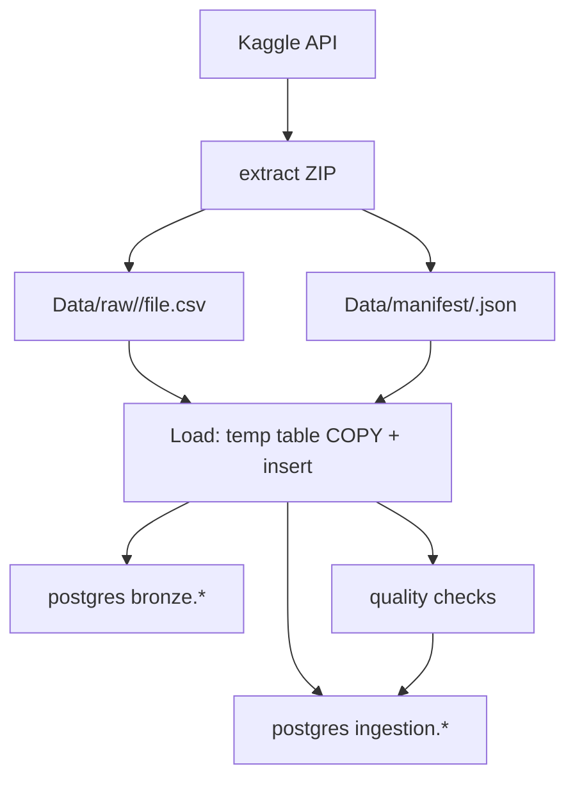

Medallion-architecture data warehouse for the Olist Brazilian E-commerce dataset (~100k orders), built as a learning project to demonstrate end-to-end production-like data engineering practices. 

# Bronze layer 

This project's bronze layer provides raw custody of the olist Kaggle dataset in postgres, with a lightweight audit trail and basic quality checks. It is designed to be:

- Operationally useful for running ingestion.
- Loaded as text to avoid load failures.

---

## 1) Purpose & scope

**The Bronze Layer is for raw data custody and ingestion observability**

What bronze does:
- Downloads the kaggle dataset `olist/brazilian-ecommerce`.
- Extracts CSVs into snapshot folder under `Data/raw/`
- Loads raw CSV rows into postgres schema `bronze.*`, without business transformations.
- Adds standardized metadata columns: `_snapshot_id`, `_run_id`, `_inserted_at`, `_source_file`
- Records run and file-level status in the schema `ingestion.*`
- Runs basic data quality checks and stores results in `ingestion.quality_checks`. 

What bronze does not do:
- Type casting, normalization, deduplication beyond snapshot.
- Business logic, dimensional modeling, metrics definition (reserved for silver/gold)

---

## 2) Architecture

**Key identifiers**
- `snapshot_id`: deterministic identifier for the dataset snapshot
    - Computed as the first 16 characters of SHA-256 hash of the downloaded Kaggle zip.
    - Example location: `Data/raw/<snapshot_id>/`
- `run_id`: unique identifier pr. pipeline run.
    - Generated as an UUID at load time.
    - Stored in `ingestion.runs` and attached to each loaded row via `_run_id`.

---

## 3)  Tech Stack
- Python 3.12
- PostgreSQL 17
- Docker + Docker Compose
- Kaggle API
- tenacity (for retry logic)

---

## 4) What's Implemented

### Per-table idempotency
For each bronze table load the loader enforces delete-and reload pr. `snapshot_id` and `table`
1. `COPY` CSV into a temporary table (`LIKE bronze.<table> INCLUDING ALL`)
2. Delete existing target rows for the snapshot.
3. Insert all temp rows into the target with metadata columns appended. 

**The result**: Re-running load for the same `snapshot_id` produces the same final state for that snapshot 

### Per-file transaction boundaries
Each CSV load is executed within a single database transaction
- If a file load fails, that file's transaction is rolled back.
- The run continues by loading the remaining files.
- Failure status is recorded in `ingestion.file_loads` and the overall run is marked as `failed` in `ingestion.runs` 

### Change detection and skip behavior
The loader compares the current file hash, from the manifest, to the last recorded hash for that filename in `ingestion.file_manifest`. If unchanged, the file load is skipped.

**The result**: 
- Reduces load time when only a subset of files changed
- Can result in a partial load for new `snapshot_id` (no complete snapshot semantics).

### Metadata/lineage tracking

**Every bronze row carries `_snapshot_id`, `_run_id`, `_inserted_at` and `_source_file`, so any row can be traced back to the exact run and source file that produced it.**

The ingestion schema records an audit trail for every pipeline run:

| Table | Tracks |  
| --- | --- | 
| ingestion.runs | Run-level status (started / success / failed), snapshot references, timestamps, error messages. |
| ingestion.file_manifest | Per-file metadata pr. snapshot: SHA-256 hash, size, row count, CSV header definition |
| ingestion.file_loads | Per-file load outcome pr. run: status, rows inserted, error message |
| ingestion.quality_checks | Per-table quality checks results pr. run | 

### Automated quality checks
Quality checks run pr. loaded table and are stored in `ingestion.quality_checks`. Key: `(run_id, table_name, check_name)`

Current checks:
- `not_empty`: table contains at least one row for the snapshot.
- `row_count`: checks if the row count recorded during the extract process matches the row count loaded in the tables.
- `schema`: verifies required metadata columns and expected key columns exists.
- `pk_nulls`: verifies key columns have no nulls for the snapshot.

**Result**:
- ingestion.quality_checks.details stores check-specific metrics as JSON
- Failed checks log warnings/errors but do not automatically abort the pipeline.

### Containerized
The full pipeline runs with a single `docker-compose up`:
- `db`: Postgres 17 with a health check, DDL scripts in `docker/initdb/` run automatically on first start.
- `pipeline`: Python 3.12-slim image that waits for a healthy `db` before executing. Source and data directories are bind-mounted, so code changes don't need a rebuild.

Credentials are injected via environment variables.

### Structured logging
All pipeline output is structured JSON via `python-json-logger`, with fields: timestamp, level, logger, message. This makes the logs grep friendly and ready to forward to an aggregator without parsing.

---

## 5) Data contracts (CSV → Bronze table mapping)

The ingestion contract is defined in `src/bronze/config.py` (`FILE_TO_TABLE` mapping).

| Source filename | Bronze table | Grain / key notes |
|---|---|---|
| `olist_orders_dataset.csv` | `bronze.orders` | keyed by `order_id` |
| `olist_order_items_dataset.csv` | `bronze.order_items` | keyed by `order_id + order_item_id` |
| `olist_customers_dataset.csv` | `bronze.customers` | keyed by `customer_id` |
| `olist_products_dataset.csv` | `bronze.products` | keyed by `product_id` |
| `olist_sellers_dataset.csv` | `bronze.sellers` | keyed by `seller_id` |
| `olist_order_reviews_dataset.csv` | `bronze.order_reviews` | keyed by `review_id` |
| `olist_order_payments_dataset.csv` | `bronze.order_payments` | keyed by `order_id` |
| `olist_geolocation_dataset.csv` | `bronze.geolocation` | keyed by `geolocation_zip_code_prefix` (non-unique in source) |
| `product_category_name_translation.csv` | `bronze.product_category_name_translation` | keyed by `product_category_name` |

Known quirks:
- `geolocation` is comparatively large; extraction also computes row counts, so expect heavier I/O during extract.

---

## 6) How to run

### Prerequisites
- Docker + docker compose
- Kaggle API Legacy Token credentials in environment
- Create a local `.env` from `.env.example`

Download the repo and in the terminal type:
```bash
docker-compose up -d --build
```
this will start the bronze pipeline automatically. 

To shut down the containers:
```bash
docker-compose down
```

To remove the data from the docker services and start anew:
```bash
docker-compose down -v
```

To run a single file manually via the docker service pipeline: 
```bash
docker-compose run --rm pipeline python -m bronze.<full_file_name>
```

Where to look if something fails:
```bash
docker-compose logs -f db
docker-compose logs -f pipeline
```

---

## 7) Decisions and trade-offs
- Why postgres for bronze
    - Fast, reliable, easy to run locally, and simple to inspect and reproduce.

- Why store raw columns as `TEXT`
    - Makes ingestion resilient to small format changes (avoids load failures). Converting to "proper types" is handled later.

- Why load into a temporary staging area first
    - To prevent partial loads. Ensures we either fully load the file or not at all.

- Why use COPY
    - `COPY` is the fastest safe bulk load in postgres

- Why the snapshot ID is deterministic
    - The same source archive produces the same ID and supports traceability across runs.

- Trade-off: skipping unchanged files
    - Faster runs, however it gives weaker guarantees that every table was reloaded for a snapshot.
    - If strict completeness is required, then a safer approach is to reload all files for each snapshot.
 


## 8) Roadmap
- [ ] Unit tests
- [ ] Silver layer (cleaning, typing, deduplication)
- [ ] Gold layer (business-level aggregates)
